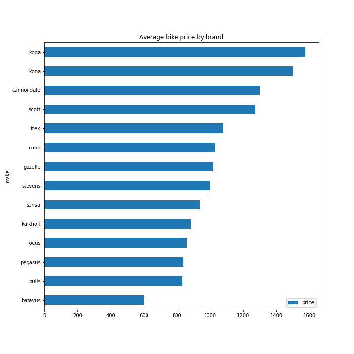
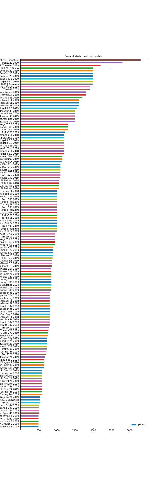

# web-scrapper
Python bs4 prices scrapper

For some time I wanted to know if bike prices change over time. Especially I was interested in seasonal fluctuations.
Therefore I created this python code which I run once a week and store data into CSV file to analyse it later.

The scrapper is available as a python script and as a Jupyter Notebook.

The analytics part will be availble in a new notebook after some data have been acumulated.

